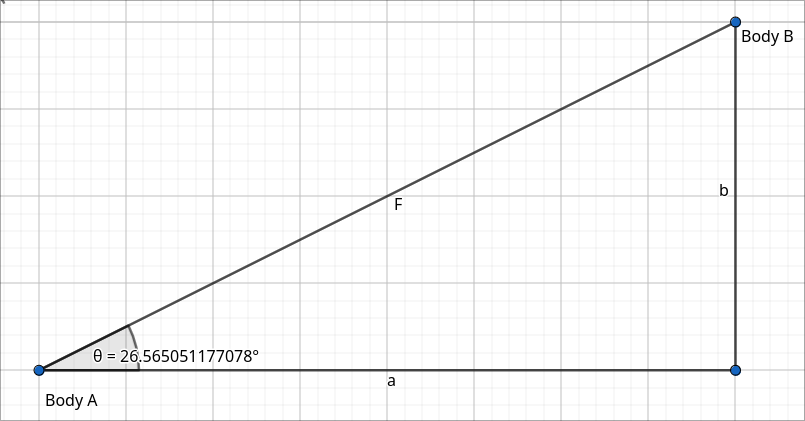

# Gravitational Simulation
A simple SDL2 project to simulate Newtonian gravity. You can add as many bodies in the simulation as you like.

Please understand that, for now, this is just a WIP project.

**Screenshot**:



# How to play
Currently, you have to edit the source code to add bodies to the simulation. You only have to add more structs to a struct array and it's done. I'll implement an easier way to do this in the future, though.

The source code already includes a solar system as an example.

### Key bindings
`Right Click + Mouse`: Move camera

`Mouse Wheel`: Zoom in/out

`P`: Pause

`C`: Center camera

# Dependencies
- SDL2

I will assume you know how to install the dependencies on your system.

# Running
This project has been developed on a Linux system, i don't know if it will work on a Windows machine. Please try it out and if it doesn't work, you can make an issue here.

### For Linux:
```
$ git clone https://github.com/rodrigolitzius/GravitationalSimulation
$ cd GravitationalSimulation
$ sh compile-and-run.sh
```
