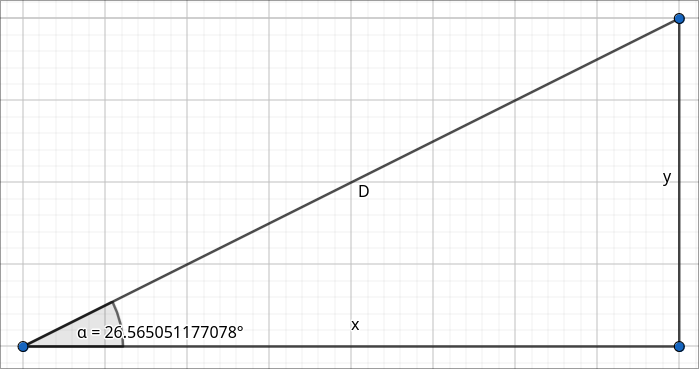

# Gravitational Simulation
A simple SDL2 project to simulate Newtonian gravity. You can add as many bodies in the simulation as you like.

Please understand that, for now, this is just a WIP project.


https://github.com/rodrigolitzius/GravitationalSimulation/assets/60452545/e94f471a-b377-463b-94b8-04e2d04ef23a


# How to play
Currently, you have to edit the source code to add bodies to the simulation. You only have to add more structs to a struct array and it's done. I'll implement an easier way to do this in the future, though.

The source code already includes a solar system as an example.

### Key bindings
| Key | Action |
| -- | -- |
| Right Click + Mouse` | Move camera |
| Mouse Wheel | Zoom in/out |
| P | Pause |
| C | Center camera |


# Dependencies
- [SDL2](https://www.libsdl.org/)

I will assume you know how to install the dependencies on your system.

# Running
This project has been developed on a Linux system, i don't know if it will work on a Windows machine. Please try it out and if it doesn't work, you can make an issue here.

### For Linux:
```
git clone https://github.com/rodrigolitzius/GravitationalSimulation
cd GravitationalSimulation
make
./main
```

# How it works
The program calculates the gravitational force exerted on one body by all the other bodies in the simulation (that means it has a time complexity of O(n²))

It uses Newton's gravitational equation
```F = (G*M1*M2) / D*D```

Since it uses classical mechanics, it is not an accurate representation of real physical bodies.

## Bodies
Bodies are stored as a `struct` with 3 main values: **position**, **velocity** and **acceleration**

The velocity of every body is added to their position every frame. This makes the body move.

The acceleration is the direction and force of the gravitational attraction. It is calculated using the `F = ma` equation (`a = F/m`).

It is necessary for implementing Newton's first law of motion:
> A body remains at rest, or in motion at a constant speed in a straight line, except insofar as it is acted upon by a force.

Lets say a body's velocity and acceleration are 100 and -1 respectively. At every frame the body will move by its velocity and add its acceleration to its velocity.

On the first frame it'll move 100 units

On the second it'll move 99

on the third, 98...

And so on.

What'll happen is the body will move in some direction, and after some time, come to a stop and move on the opposite direction. This perfectly implements newtons first law of motion.

## The `gravity()` function
This function is the heart of the program. It calculates the acceleration exerted on a body by another body.

Since the acceleration is vector, it has to have a magnitude and a direction. The magnitude is simple enough to calculate. Its is simply `F/m`.

To calculate the direction, trigonometry is required.


The `F` side of the triangle is the gravitational accelation.
`a` and `b` are the acceleration on the X and Y axis individually. This is what we want to calculate

The sides of a right triangle are given by `cos(θ)*F` and `sin(θ)*F`.

If we calculate the distance between the two bodies, we get another tringle:



`D` is the total distance. `x` and `y` and are the distance in the X and Y axis.

Since both triangles are similar, they have the same sine and cosine, so now we just have to calculate sine and cosine and multiply them with `F` to get `a` and `b`.

cosine = `x/D`, sine = `y/D`

`a = (x/D)*F`, `b = (y/D)*F`

## Camera and zoom
### Camera
To implement camera movement, There is a `struct` which holds 3 values: `X`, `Y` and `scale`.

When the player moves the camera to the left, the bodies should go to the right, and to implement that, i added draw offset values (`X`, and `Y`). These are added to a body's position at the time it should be drawn to the screen, achieving the camera movement effect.

### Zoom
Zooming is done with the `scale` value. At draw-time, it is multiplied to every body's position and radius, scaling them.

The issue with this approach is that, when the user zooms out, the `scale` approaches 0, and so does the bodies positions, therefore every body gets closer and closer to the top left corner of the screen (SDL's window coordinate origin)

(This behaviour is seem on the preview video)

>*There is an explanation of the mitigation to this issue as a comment in the `apply_view()` function in the `view.c` file.*